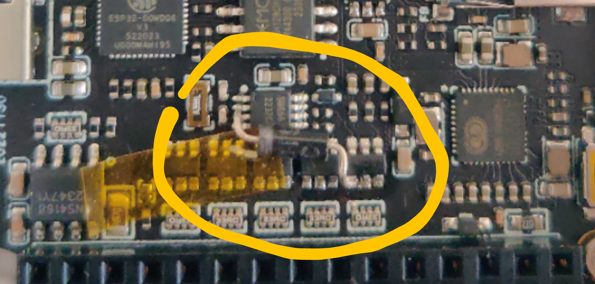

# M5Stack Core2 V1.1 Rust+Slint Gadget

An experimental Rust+Slint project on M5Stack Core2 V1.1.

It currently contains an implmentation of EvilAppleJuice in Rust for ESP32, though not efficient.

**It only supports the V1.1 variant! The 1.1 version uses AXP2101 instead of AXP192!**

**The hardware is modded to utilize PMU's interrupt signal! Connect AXP_WAKEUP(PMU & RTC interrupt pin) to GPIO19 with a diode like 1N5819! Well it's a bit hard since the space is quite limited.** Without this mod, the program will run normally, but no PMU's interrupt event is processed, thus the hardware button becomes a bit useless.

The 3 touch buttons are mapped to F1, F2, F3(yes the FN keys on the keyboard), respectively, from left to right. No feature is binded to those touch buttons though.

## License

This project is released under the GNU Affero General Public License.
